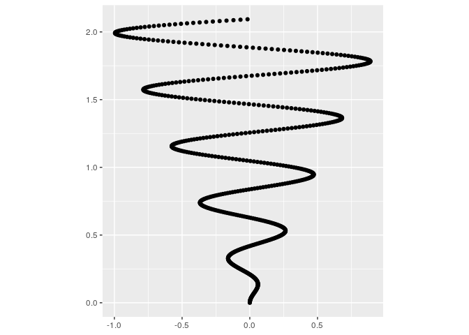
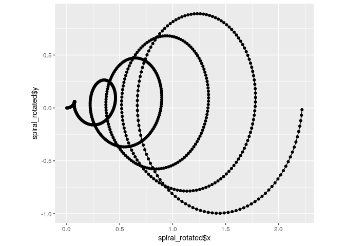

dddr: Three-Dimensional Vector Operations in R
================

# About

The R package `dddr` is a
[`vctrs`](https://github.com/r-lib/vctrs/)-based package for working
with three-diensional spatial data. It gives three-dimensional objects
like points, velocities, and rotations first-class vector status in R,
enabling usage as column types within `data.frame` and `tibble`.

In contrast to most spatial R packages like `sf` or `rspatial` that work
with geographic, 2-dimensional data, `dddr` works best with
3-dimensional data. The origin of this package was to analyze behavioral
data (e.g, hand motion, head direction) in studies of virtual and
augmented reality.

<!-- badges: start -->

[](https://travis-ci.com/MrMallIronmaker/dddr)
[](https://codecov.io/gh/MrMallIronmaker/dddr?branch=master)
<!-- badges: end -->

# Quick View

``` r
library(tidyverse)
library(dddr)
```

``` r
spiral <- tibble(i = seq(0, 10*pi, 0.05)) %>%
  mutate(
    # vector3s are created using three numeric vector arguments,
    # and thanks to dplyr, can refer to other columns in the dataframe
    circular_part = vector3(x=cos(i), y=sin(i), z=0),
    forward_part = vector3(x=0, y=0, z=i/15),
    # vector3s can be added together and multiplied by numerics 
    spiral_part = circular_part * i / 30 + forward_part
  )

spiral %>% head(10)
```

    ## # A tibble: 10 x 4
    ##        i      circular_part    forward_part                   spiral_part
    ##    <dbl>             <vct3>          <vct3>                        <vct3>
    ##  1  0    (1    , 0     , 0) (0, 0, 0      ) (0      , 0        , 0      )
    ##  2  0.05 (0.999, 0.0500, 0) (0, 0, 0.00333) (0.00166, 0.0000833, 0.00333)
    ##  3  0.1  (0.995, 0.0998, 0) (0, 0, 0.00667) (0.00332, 0.000333 , 0.00667)
    ##  4  0.15 (0.989, 0.149 , 0) (0, 0, 0.01   ) (0.00494, 0.000747 , 0.01   )
    ##  5  0.2  (0.980, 0.199 , 0) (0, 0, 0.0133 ) (0.00653, 0.00132  , 0.0133 )
    ##  6  0.25 (0.969, 0.247 , 0) (0, 0, 0.0167 ) (0.00807, 0.00206  , 0.0167 )
    ##  7  0.3  (0.955, 0.296 , 0) (0, 0, 0.02   ) (0.00955, 0.00296  , 0.02   )
    ##  8  0.35 (0.939, 0.343 , 0) (0, 0, 0.0233 ) (0.0110 , 0.00400  , 0.0233 )
    ##  9  0.4  (0.921, 0.389 , 0) (0, 0, 0.0267 ) (0.0123 , 0.00519  , 0.0267 )
    ## 10  0.45 (0.900, 0.435 , 0) (0, 0, 0.03   ) (0.0135 , 0.00652  , 0.03   )

``` r
spiral %>%
  # field access uses the $ operator
  ggplot(aes(x=spiral_part$x, y=spiral_part$y)) +
  geom_point() +
  geom_path() +
  coord_equal()
```

<!-- -->

``` r
spiral %>%
  mutate(
    # rotations can be specified using quaternions, axis / angle, or even from / to vectors
    spiral_rotated = rotate(spiral_part, axis=c(0, 1, 0), angle=pi/4)
  ) %>% 
  ggplot(aes(x=spiral_rotated$x, y=spiral_rotated$y)) +
  geom_point() +
  geom_path() +
  coord_equal()
```

<!-- -->

# Installation

``` r
install.packages("devtools") # if you have not installed "devtools" package
# For the most recent packaged & released version
devtools::install_github("MrMallIronmaker/dddr@*release")
# For the development version
devtools::install_github("MrMallIronmaker/dddr")
```

# Questions

If you have questions in how to use this library, what this library is
useful for, or if it has any particular features, it would be helpful to
contact me directly at `mrmillr at stanford.edu`. This project is in its
early development stages, and I want to know how you want to use the
library / are using the library.

# Contributions

Contributions are welcome\! The issue tracker in this repo can be used
for bug reports, feature requests, and questions - whatever you might
need.
